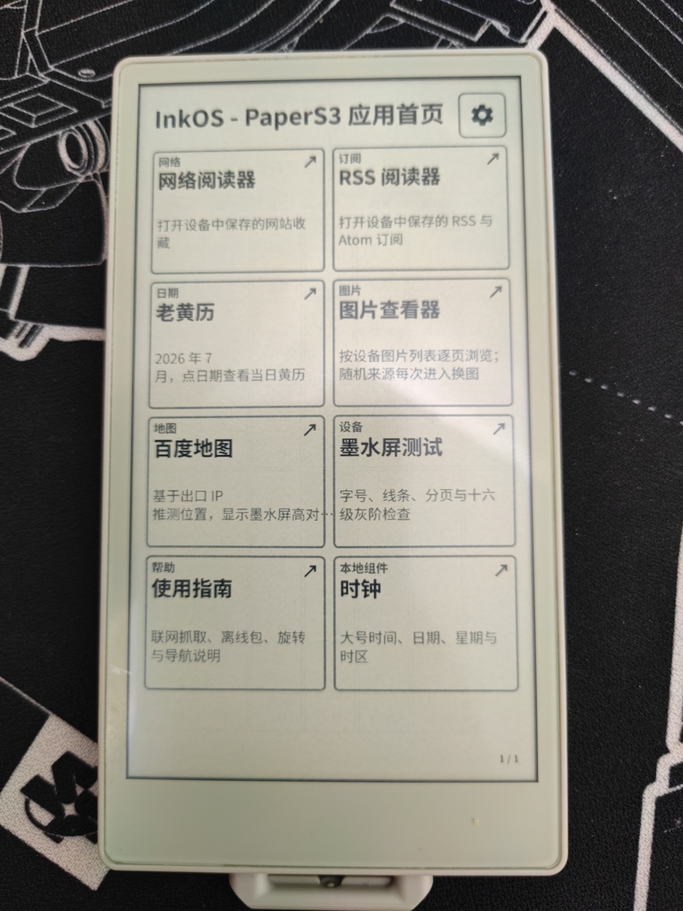
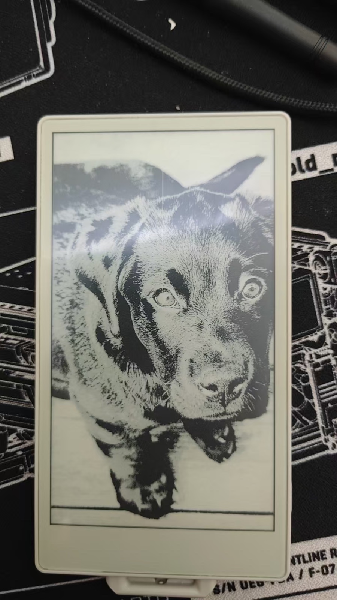
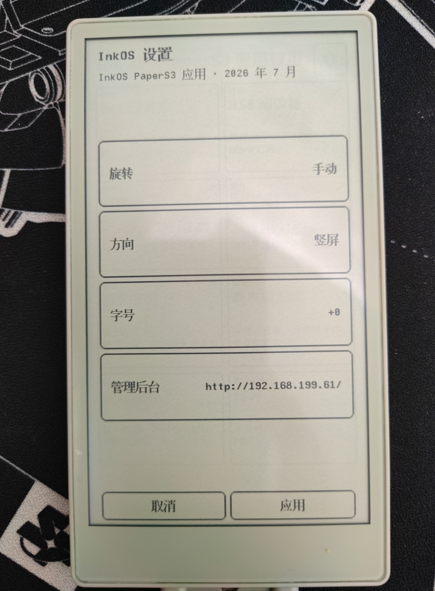
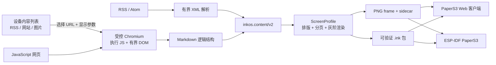
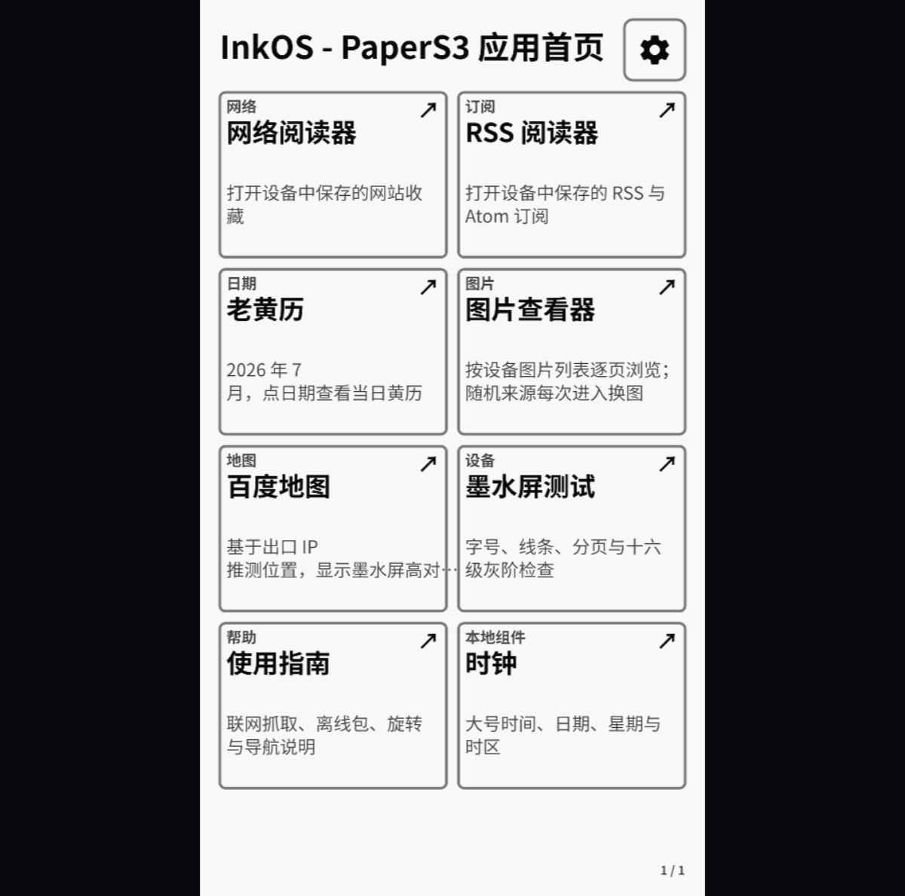
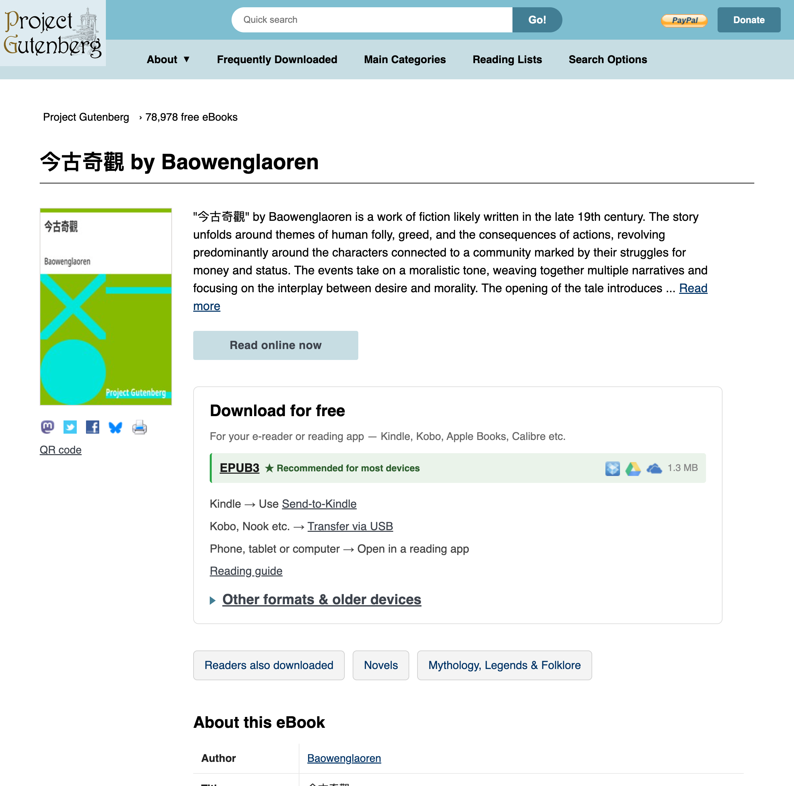
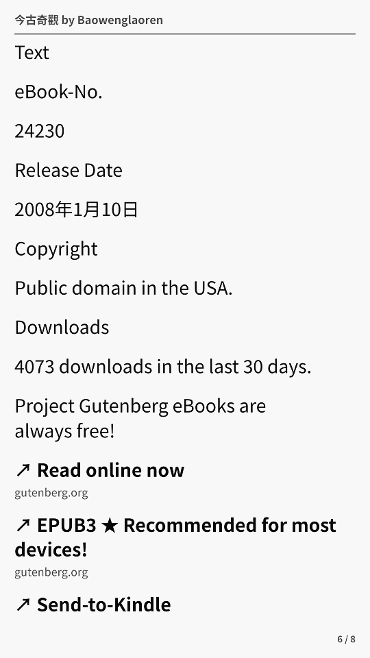
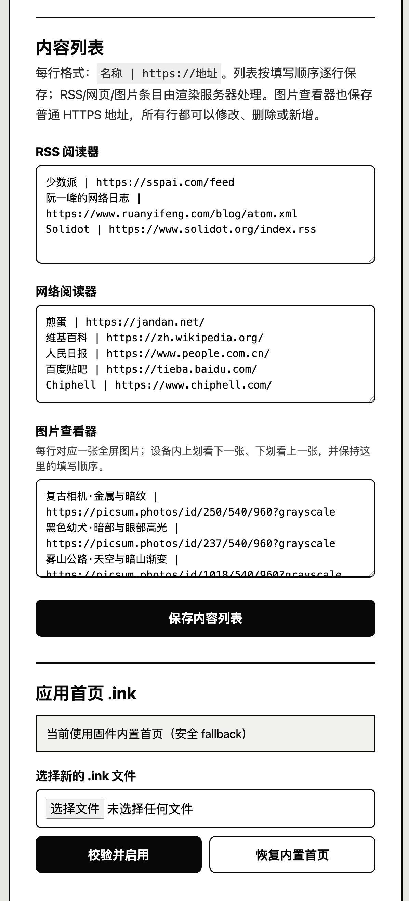

<p align="center">
  
</p>

<h1 align="center">InkOS</h1>

<p align="center">
  <strong>把互联网内容变成墨水屏原生内容。</strong><br>
  从 RSS、动态网页和图片，到 PaperS3 上可触摸、可分页、可离线的 16 级灰阶页面。
</p>

<p align="center">
  <a href="#中文">中文</a> ·
  <a href="#english">English</a> ·
  <a href="./docs/generate-ink.md">生成与安装 .ink</a> ·
  <a href="./docs/client-protocol.md">客户端协议</a> ·
  <a href="./docs/ink-package-format.md">包格式</a>
</p>

<table>
  <tr>
    <td width="33%"></td>
    <td width="33%"></td>
    <td width="33%"></td>
  </tr>
  <tr>
    <td align="center">应用首页</td>
    <td align="center">16 级灰阶图片</td>
    <td align="center">设备设置</td>
  </tr>
</table>

## 中文

### 它不是“把网页截图缩小”

InkOS 是一套面向电子墨水屏的内容系统、服务端语义渲染器和客户端协议。

HTML、CSS 和 JavaScript 留在服务器上；ESP32 不运行浏览器，也不直接抓取目标
网站。设备只提交想打开的 URL 和当前显示参数，服务器执行受控抓取，把页面转换为
Markdown 逻辑结构，再生成不带坐标的 `inkos.content/v2` 语义内容。最终的排版、
分页、字体、图片处理和灰阶量化由目标屏幕的 `ScreenProfile` 决定。

设备收到的是经过校验的页面帧、链接点击区域、导航关系和可选 `.ink` 离线包，而
不是一张失去结构的网页截图。



### 内容规范：类型是语义，布局只是意图

`inkos.content/v2` 先描述页面是什么，再给出可选的高层布局意图。它们不是固定模板，
更不允许携带列数、坐标、像素尺寸、字体名或设备判断：

| 页面类型 `kind` | 布局意图 `layout` | 用途 |
| --- | --- | --- |
| `detail` | `article` | 有标题的文章、详情与 RSS 正文 |
| `detail` | `image-story` | 图片优先、文字辅助的详情页 |
| `detail` | `postcard` | 居中的单一视觉焦点、卡片或海报 |
| `list` | `feed` | 带标题、摘要、图片与链接的信息流 |
| `list` | `list` | 菜单、时间线和顺序条目 |
| `list` | `grid` | 响应式网格、应用首页和月历 |
| `list` | `masonry` | 按图片自然比例组织的瀑布流 |
| `list` | `bookshelf` | 封面目录和电子书首页 |
| `list` | `cardboard` | 多个并列状态卡片组成的看板 |
| `reader` | 无 | 没有标题栏的纯文本阅读页 |
| `image` | `contain` | 全屏完整显示图片，允许留边 |
| `image` | `cover` | 等比铺满全屏，允许居中裁剪 |

列表项仍然只包含标题、摘要、图片、元信息和链接；详情内容仍然只是段落、标题、图片、
列表、引用和链接。二维码是图片，日期和时间是文本。PaperS3 竖屏的 `grid` 可以是
两列，横屏可以是四列；`masonry` 的列宽、分页和裁切也都由当前
`ScreenProfile` 与渲染器决定。

### 它是活的，不是刷进固件的一张死图

设备保存的是你的内容入口和阅读状态，服务器返回的是打开那一刻的内容。

- RSS、网站和图片是设备持久化的有序列表，可以随时增加、删除、改名和排序。
- 打开某一项后，渲染服务器会按需获取目标内容；JavaScript 网站由 Chromium 完整
  执行后再提取，RSS/Atom 则走独立的安全解析路径。
- 服务器把内容整理为标题、段落、图片、列表和真实链接，再按照 PaperS3 的方向、
  字号、PPI 和 16 灰阶能力重新分页渲染。
- 当前用户请求优先同步渲染；语义包和已完成页面可按版本缓存，不需要枚举所有可能
  的屏幕变体。
- 客户端翻页、打开文章、返回列表和点击原文链接时，使用 sidecar 中经过校验的
  hitbox 与导航关系。

这意味着修改内容列表不需要重新编译或刷写固件。InkOS 的首页、列表和文章都是
可以继续生长的内容，而不是固定 UI 截图。

### 连首页也是内容：`.ink`

InkOS 首页不是硬编码界面，而是一份普通的、纯数据的 `.ink` 包。它可以包含：

- 坐标无关的语义文档；
- 针对目标设备预渲染的页面；
- 链接点击区域与父子导航；
- 完整的长度、SHA-256、版本和兼容性清单；
- 可选的图片源文件与本地时钟组件。

你可以用网站生成器把网页变成 `.ink`，也可以修改结构化首页内容，生成自己的应用
入口。PaperS3 管理后台会先完整校验上传包，再在两个存储槽之间原子切换；上传中断、
文件损坏或不兼容时，固件内置首页仍然是安全 fallback。

**完整步骤： [生成、下载并安装 `.ink` 文件](./docs/generate-ink.md)**

### 同一份首页，两个真正的客户端

TypeScript 网页客户端和 C++/ESP-IDF 实机客户端执行同一套 `.ink`、frame、
sidecar 与导航约定。网页画面可以用于调试，但最终效果始终以真实电子纸为准。

<table>
  <tr>
    <td width="50%"></td>
    <td width="50%"></td>
  </tr>
  <tr>
    <td align="center">浏览器 PaperS3 客户端</td>
    <td align="center">真实 PaperS3</td>
  </tr>
</table>

### 16 灰阶不是一句配置

PaperS3 的照片路径包含适合实机的灰度、对比度、轻量锐化、16 级量化和刷新策略。
设备端对图片执行白场清理、完整灰阶绘制和黑白端点强化；文字页面则使用独立的
高对比刷新判断。下面是同一张服务端帧和真实屏幕实拍：

<table>
  <tr>
    <td width="50%"></td>
    <td width="50%"></td>
  </tr>
  <tr>
    <td align="center">服务端目标帧</td>
    <td align="center">反射式电子纸实拍</td>
  </tr>
</table>

### 动态网页会保留阅读动作

服务端抓取页面时，不只是抽取正文。列表、图片、详情页和导航动作会成为结构化内容，
链接会进入可点击 sidecar。RSS 详情还会单独呈现“查看原文 / 继续阅读 / 上一篇 /
下一篇 / 栏目”等明确导航，不会把普通正文引用误判为菜单。

<table>
  <tr>
    <td width="66%"></td>
    <td width="34%"></td>
  </tr>
  <tr>
    <td align="center">执行 JavaScript 后的原网页</td>
    <td align="center">PaperS3 语义页面与真实链接</td>
  </tr>
</table>

### 局域网内直接管理

PaperS3 连接 Wi-Fi 后会提供设备管理网页。无需重新刷固件即可修改：

- Wi-Fi 与渲染服务器地址；
- RSS 阅读器列表；
- 网络阅读器收藏；
- 图片查看器列表；
- 当前应用首页 `.ink`。

<p align="center">
  
</p>

### 已实现的核心能力

| 能力 | 当前实现 |
| --- | --- |
| PaperS3 实机客户端 | 原生 ESP-IDF/C++、触摸与 IMU、Wi-Fi AP 配网、NVS 持久化、局域网管理 |
| 服务端内容管线 | Chromium → Markdown → `inkos.content/v2` → 设备排版与渲染 |
| RSS 阅读 | RSS/Atom 列表、包内详情、原文与相邻文章导航、真实链接 fallback |
| 图片与地图 | 设备图片列表、全屏浏览、PaperS3 照片灰阶路径、百度静态地图 |
| `.ink` 离线包 | 异步网站生成器、下载 API、完整性清单、设备 A/B 原子安装 |
| 双客户端 | PaperS3 浏览器客户端与 ESP-IDF 客户端共享协议 |
| 多屏渲染 | PaperS3、M5Stack Xiaozhi Card Kit、M5Stack PaperColor 屏幕配置 |
| 开放接口 | 在线渲染、URL 解析、包下载、按需变体渲染与 OpenAPI 描述 |

### 五分钟启动

需要 Node.js 和一份可用的 Chromium/Chrome：

```bash
cd web
npm install
npm run dev
```

打开：

- 模拟器：<http://127.0.0.1:3000/>
- PaperS3 网页客户端：<http://127.0.0.1:3000/papers3-client>
- 全屏网页阅读：
  <http://127.0.0.1:3000/papers3-client?fullscreen=1&url=https%3A%2F%2Fjandan.net%2F>
- `.ink` 网站生成器：<http://127.0.0.1:3000/ink-generator>
- OpenAPI：<http://127.0.0.1:3000/api/ink/v1/openapi.json>

构建 PaperS3 固件：

```bash
source /path/to/esp-idf-v5.4/export.sh
cd firmware-idf
idf.py build
idf.py -p /dev/your-paper-s3-port flash monitor
```

更完整的编译、分区和设备说明见
[`firmware-idf/README.md`](./firmware-idf/README.md)。

### 项目结构

```text
inkos/
├── web/            # Next.js 渲染服务、模拟器、网页客户端与 .ink 生成器
├── firmware-idf/   # 当前 PaperS3 ESP-IDF 客户端
├── firmware/       # 早期 Arduino/PlatformIO 参考客户端
├── docs/           # 客户端协议、服务 API 与 .ink 包格式
└── output/         # 实机调试与浏览器验收产物
```

### 协议与文档

- [如何生成与安装 `.ink`](./docs/generate-ink.md)
- [客户端协议](./docs/client-protocol.md)
- [`.ink` 包格式](./docs/ink-package-format.md)
- [网站服务 API](./docs/service-api.md)
- [PaperS3 设备管理](./docs/papers3-device-management.md)
- [渲染服务与语义内容](./web/README.md)

协议和数据格式已经按语言无关的方式拆开，方便第三方实现新的屏幕配置或客户端。
当前文档仍属于持续演进中的 Draft，正式开源 LICENSE 尚待确定。

### TODO / Roadmap

- 开发 iOS/Android 手机伴侣客户端：发现和配置设备、管理 RSS/网站/图片列表、上传
  `.ink` 首页，并方便用户连接手机或局域网中的 InkOS 渲染服务器。
- 通过手机蓝牙向 InkOS 同步精确 GPS 位置，替代地图当前的出口 IP 估算。
- 为更多电子纸设备提供独立 `ScreenProfile`、客户端实现和实机刷新策略。
- 完善多用户在线服务所需的鉴权、配额、持久队列和对象存储。

---

## English

### InkOS turns web content into native e-paper content

InkOS is an e-paper content system, a server-side semantic renderer, and a
client protocol. It converts RSS feeds, JavaScript websites, and image
collections into touchable, paginated, optionally offline pages for devices
such as the M5Stack PaperS3.

It does not squeeze a desktop screenshot onto a small display, and it does not
run a browser on the ESP32. HTML, CSS, and JavaScript stay on the server. A
device submits the URL it wants to open together with its current orientation
and font level. The service then runs a bounded Chromium capture or a dedicated
RSS/Atom parser, produces Markdown-like logical structure, converts it to
coordinate-free `inkos.content/v2`, and lays it out for a trusted
`ScreenProfile`.

The client receives verified frames, interaction hitboxes, navigation
relationships, and optional `.ink` archives.

### Content contract: semantic kinds and layout intents

`inkos.content/v2` first states what a page is, then optionally suggests a
high-level layout intent. These values are not pixel templates and never carry
column counts, coordinates, dimensions, font names, or device branches:

| Page `kind` | Layout intent | Intended content |
| --- | --- | --- |
| `detail` | `article` | Titled articles, details, and RSS bodies |
| `detail` | `image-story` | Image-led editorial details |
| `detail` | `postcard` | A centered visual focus, card, or poster |
| `list` | `feed` | A stream with titles, summaries, images, and links |
| `list` | `list` | Menus, timelines, and ordered entries |
| `list` | `grid` | Responsive grids, application homes, and calendars |
| `list` | `masonry` | A waterfall that preserves natural image proportions |
| `list` | `bookshelf` | Cover catalogs and e-book home screens |
| `list` | `cardboard` | A dashboard composed of parallel status cards |
| `reader` | none | Title-free long-form text |
| `image` | `contain` | An uncropped full-screen image with optional matte |
| `image` | `cover` | An aspect-preserving full-screen image with center crop |

Items remain plain titles, summaries, images, metadata, and links. Detail
blocks remain paragraphs, headings, images, lists, quotes, and links. QR codes
are images; dates and times are text. The active `ScreenProfile` and renderer
choose columns, pagination, crop, typography, and gray/color quantization.

### Live content, not a frozen firmware image

The device persists ordered RSS, website, and image collections. Users can add,
remove, rename, and reorder those entries without rebuilding firmware. When an
entry is opened, InkOS fetches the current source on the server and renders the
requested display variant on demand.

The current user request has foreground priority. Semantic packages and
completed frames can be cached by revision, while unused combinations of every
orientation and font level are not eagerly enumerated.

### The home screen is a `.ink` package too

`.ink` is a data-only ZIP interchange format. It contains semantic documents,
pre-rendered frames, sidecar hitboxes, navigation, compatibility metadata, and
cryptographic integrity records; it contains no executable package code.

A generated `.ink` file can become the PaperS3 home screen. The device manager
validates the complete archive before atomically switching storage slots. An
interrupted upload, a damaged archive, or an incompatible package leaves the
firmware-embedded home available as a safe fallback.

**Read the complete [`.ink` generation and installation guide](./docs/generate-ink.md).**

### What is implemented

| Area | Current implementation |
| --- | --- |
| PaperS3 device | Native ESP-IDF/C++, touch and IMU input, Wi-Fi AP provisioning, NVS persistence, LAN manager |
| Content pipeline | Chromium → Markdown → `inkos.content/v2` → device-specific layout and rasterization |
| RSS reading | RSS/Atom lists, packaged details, original/adjacent article actions, verified fallbacks |
| Images and maps | Persistent image collection, full-screen paging, PaperS3 photo-gray path, Baidu static map |
| Offline packages | Asynchronous website generator, download API, integrity manifest, atomic A/B installation |
| Two clients | Browser PaperS3 client and native ESP-IDF client using the same protocol |
| Multiple displays | Profiles for PaperS3, M5Stack Xiaozhi Card Kit, and M5Stack PaperColor |
| Service API | Online rendering, source resolution, package delivery, on-demand variants, and OpenAPI |

### Quick start

Install Node.js and make Chromium or Chrome available:

```bash
cd web
npm install
npm run dev
```

Open:

- Simulator: <http://127.0.0.1:3000/>
- PaperS3 web client: <http://127.0.0.1:3000/papers3-client>
- Full-screen URL reader:
  <http://127.0.0.1:3000/papers3-client?fullscreen=1&url=https%3A%2F%2Fjandan.net%2F>
- `.ink` generator: <http://127.0.0.1:3000/ink-generator>
- OpenAPI: <http://127.0.0.1:3000/api/ink/v1/openapi.json>

Build the PaperS3 firmware:

```bash
source /path/to/esp-idf-v5.4/export.sh
cd firmware-idf
idf.py build
idf.py -p /dev/your-paper-s3-port flash monitor
```

See [`firmware-idf/README.md`](./firmware-idf/README.md) for the complete
firmware workflow.

### Repository layout

```text
inkos/
├── web/            # Next.js renderer, simulator, web client, and .ink generator
├── firmware-idf/   # Current PaperS3 ESP-IDF client
├── firmware/       # Earlier Arduino/PlatformIO reference client
├── docs/           # Client protocol, service API, and package format
└── output/         # Browser acceptance and physical-device diagnostics
```

### Documentation

- [Generate and install `.ink`](./docs/generate-ink.md)
- [Client protocol](./docs/client-protocol.md)
- [`.ink` package format](./docs/ink-package-format.md)
- [Website service API](./docs/service-api.md)
- [PaperS3 device management](./docs/papers3-device-management.md)
- [Rendering and semantic content](./web/README.md)

The protocol is language-independent so third parties can implement another
client or display profile without sharing the renderer implementation. The
specification is still evolving as a Draft, and a formal open-source license
has not yet been selected.

### TODO / Roadmap

- Build an iOS/Android companion app for device discovery and setup, content
  collection management, `.ink` home uploads, and convenient use of an InkOS
  renderer running on a phone or the local network.
- Synchronize accurate phone GPS over Bluetooth instead of relying on the
  map service's current public-IP estimate.
- Add device-specific clients, screen profiles, and physical refresh policies
  for more e-paper hardware.
- Add authentication, quotas, a durable queue, and object storage for a
  multi-user hosted service.
